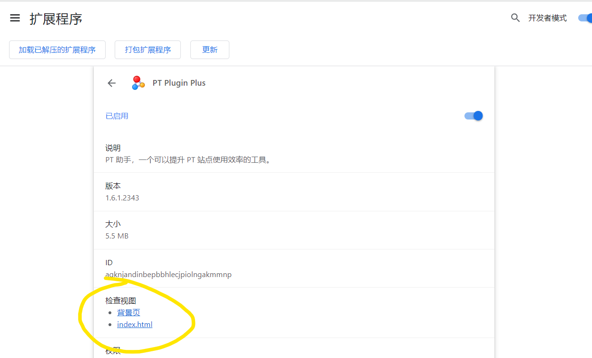
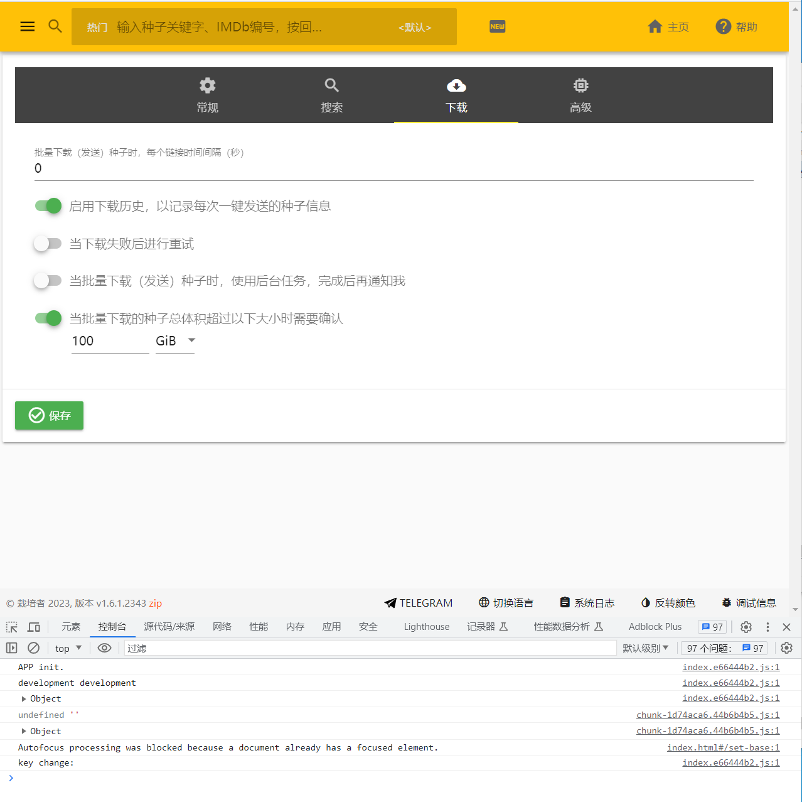
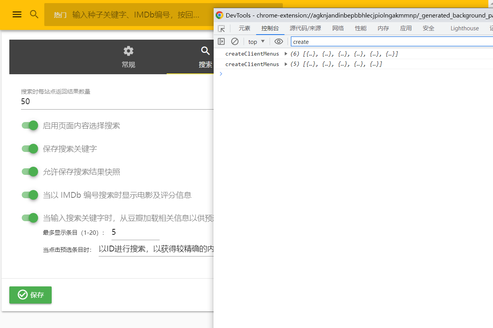

## PTPP 开发指引

* https://github.com/pt-plugins/PT-Plugin-Plus/wiki/developer

## PTPP 后端日志查看

1. 打开 Chrome 插件页 chrome://extensions/
2. 找到对应插件
3. 这里可以看到有两个页面 一个是 `index.html`, 一个是 `背景页`
4. index.html 就是点击PTPP按钮看到的主页面，而 背景页 就是后台日志输出的地方，可进行 debug 等操作。

 

5. 从项目结构上来说, 打开F12即可看见日志。
   1. `src/background` 的日志将会输出到 `背景页`。
   2. `src/options` 里面的日志，将会输出到 `index.html`。

```
.
├── .github #保存一些 github 网站上的配置文件，如：issue 模板、pull request 模板等
├── debug #保存本地调试时后台服务，仅调试用户界面会用到
├── dist #打包后输出的位置
├── public #保存一些公用的资源文件，编译时会将该目录下所有文件生成到 dist 目录
├── resource
│     ├── clients #下载客户端实现代码，新增客户端适配文件将保存在这里
│     ├── i18n #多语言资源文件
│     ├── libs #一些公用的库
│     ├── publicSites #公网站点配置文件
│     ├── schemas #网站架构模板
│     └── sites #网站配置文件
├── src #插件主要代码
│     ├── background #插件一些常驻内存的 `后台` 服务代码，即 `背景页` 所看到的内容
│     ├── content #该内容会插入到每个需要显示插件图标及相关功能的网站，通常被称为 `内容脚本`
│     ├── debugger #一些公用的定义，如类型等
│     ├── interface 
│     ├── options #插件选项页面代码，如配置、搜索等
│     ├── popup
│     └── service #公用的一些服务类
├── update
└── webpack #编译时的一些配置文件
```

* index.html



* 背景页




## 右键菜单修改未生效？

> [右键菜单注入代码](https://github.com/pt-plugins/PT-Plugin-Plus/blob/f00d6972ac079d1cfc4b64f2eed52a1c37aeca52/src/background/contextMenus.ts#L90)  

* 重启浏览器试试

## formerHosts 使用说明

* 只有在插件升级的时候才会被使用到，用于迁移旧的配置文件。
* src/background/service.ts:601
* src/background/userData.ts:111

> 适用于站点 URL 变更之后旧数据的迁移合并.  
>

1. 假设之前的 URL 是: `https://kp.m-team.cc` 现在变更为 `https://xp.m-team.io`
2. 那么在 `formerHosts` 中配置加上 `kp.m-team.cc`，如下所示：

```json
{
   "formerHosts": [
      "kp.m-team.cc"
   ]
}
```

## userExtendInfo 是否必须？

* 因为代码问题, 必须填写, 要不然部分数据会缺失...

* 大概位置在 `user.ts`, 可以参考 `7b8d2e00342ac2734494c47b60e8c9886df69b71` 这个 commit.
